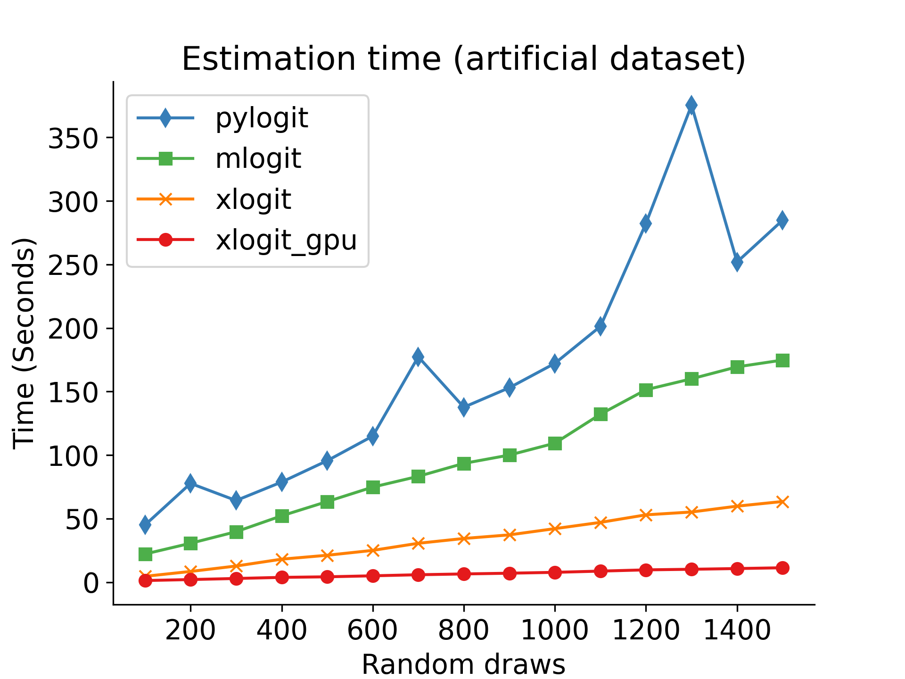
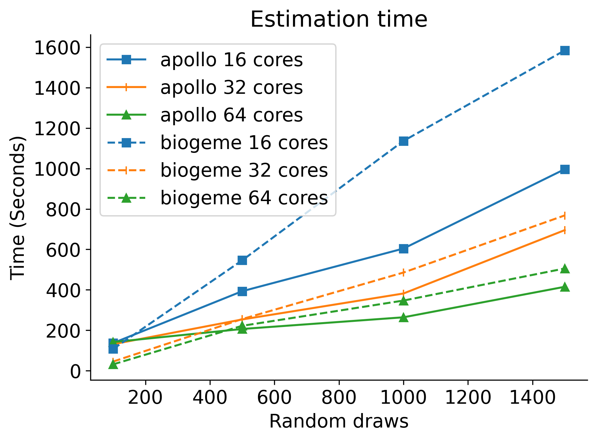

==============================================================================
xlogit: A Python package for GPU-accelerated estimation of mixed logit models.
==============================================================================

|Travis| |Coverage| |Docs| |PyPi| |License|

.. _Mixed Logit: https://xlogit.readthedocs.io/en/latest/api/mixed_logit.html
.. _Multinomial Logit: https://xlogit.readthedocs.io/en/latest/api/multinomial_logit.html

Quick start
===========
The following example uses ``xlogit`` to estimate a mixed logit model for choices of fishing modes. See the data `here <https://github.com/arteagac/xlogit/blob/master/examples/data/fishing_long.csv>`__ and more information about the data `here <https://doi.org/10.1162/003465399767923827>`__. The parameters are:

* ``X``: 2-D array of input data (in long format) with choice situations as rows, and variables as columns
* ``y``: 1-D array of choices (in long format)
* ``varnames``: List of variable names that matches the number and order of the columns in ``X``
* ``alts``:  1-D array of alternative indexes or an alternatives list
* ``ids``:  1-D array of the ids of the choice situations
* ``randvars``: dictionary of variables and their mixing distributions (``"n"`` normal, ``"ln"`` lognormal, ``"t"`` triangular, ``"u"`` uniform, ``"tn"`` truncated normal)

The current version of `xlogit` only supports input data in long format.

.. code-block:: python

    # Read data from CSV file
    import pandas as pd
    df = pd.read_csv("examples/data/fishing_long.csv")

    X = df[['price', 'catch']]
    y = df['choice']

    # Fit the model with xlogit
    from xlogit import MixedLogit
    model = MixedLogit()
    model.fit(X, y,
              varnames=['price', 'catch'],
              ids=df['id'],
              alts=df['alt'],
              randvars={'price': 'n', 'catch': 'n'})
    model.summary()

::

    Estimation succesfully completed after 21 iterations.
    ------------------------------------------------------------------------
    Coefficient           Estimate      Std.Err.         z-val         P>|z|
    ------------------------------------------------------------------------
    price               -0.0274061     0.0022827   -12.0062499       2.2e-30 ***
    catch                1.3345446     0.1735364     7.6902874      2.29e-13 ***
    sd.price             0.0104608     0.0020466     5.1113049      1.93e-06 ***
    sd.catch             1.5857201     0.3746104     4.2329844      0.000109 ***
    ------------------------------------------------------------------------
    Significance:  0 '***' 0.001 '**' 0.01 '*' 0.05 '.' 0.1 ' ' 1

    Log-Likelihood= -1300.227
    AIC= 2608.454
    BIC= 2628.754
    Estimation time= 0.7 seconds

For more examples of ``xlogit`` see `this Jupyter Notebook in Google Colab <https://colab.research.google.com/github/arteagac/xlogit/blob/master/examples/mixed_logit_model.ipynb>`__. Google Colab provides GPU processing for free, which will help you to significantly speed up your model estimation using ``xlogit``.

Quick install
=============
Install ``xlogit`` using ``pip`` as follows:

.. code-block:: bash

   pip install xlogit

.. hint::

   To enable GPU processing, you must install the `CuPy Python library <https://docs.cupy.dev/en/stable/install.html>`__.  When ``xlogit`` detects that CuPy is properly installed, it switches to GPU processing without any additional setup. 

For additional installation details check `xlogit documentation <https://xlogit.readthedocs.io/en/latest/install.html>`__.

No GPU? No problem
==================
``xlogit`` can also be used without a GPU. However, if you need to speed up your model estimation, there are several low cost and even free options to access cloud GPU resources. For instance:

- `Google Colab <https://colab.research.google.com>`_ offers free GPU resources for learning purposes with no setup required, as the service can be accessed using a web browser. Using xlogit in Google Colab is very easy as it runs out of the box without needing to install CUDA or CuPy, which are installed by default. For examples of xlogit running in Google Colab `see this link <https://colab.research.google.com/github/arteagac/xlogit/blob/master/examples/mixed_logit_model.ipynb>`_.
- The `Google Cloud platform <https://cloud.google.com/compute/gpus-pricing>`_ offers GPU processing starting at $0.45 USD per hour for a NVIDIA Tesla K80 GPU with 4,992 CUDA cores.
- `Amazon Sagemaker <https://aws.amazon.com/ec2/instance-types/p2/>`_ offers virtual machine instances with the same TESLA K80 GPU at less than $1 USD per hour.

Benchmark
=========
``xlogit`` is significantly faster than existing estimation packages (see the plots below). All the material to run the and replicate the benchmark can be found in the ``examples/benchmark`` folder.

Notes
=====
The current version allows estimation of:

- `Mixed Logit`_ with several types of mixing distributions (normal, lognormal, triangular, uniform, and truncated normal)
- `Mixed Logit`_ with panel data
- `Mixed Logit`_ with unbalanced panel data
- `Mixed Logit`_ with Halton draws
- `Multinomial Logit`_ models
- `Conditional logit <https://xlogit.readthedocs.io/en/latest/api/multinomial_logit.html>`_ models
- Weighed regression for all of the logit-based models

Citing ``xlogit``
=================
Please cite ``xlogit`` as follows:

    Arteaga, C., Park, J., Bhat, P., & Paz, A. (2021). xlogit: A Python package for GPU-accelerated estimation of mixed logit models. https://github.com/arteagac/xlogit
    
Or using BibTex as follows::

    @misc{xlogit,
        author = {Arteaga, Cristian and Park, JeeWoong and Bhat, Prithvi and Paz, Alexander},
        title = {{xlogit: A Python package for GPU-accelerated estimation of mixed logit models.}},
        url = {https://github.com/arteagac/xlogit},
        year = {2021}
    }

.. |Travis| image:: https://travis-ci.com/arteagac/xlogit.svg?branch=master
   :target: https://travis-ci.com/arteagac/xlogit

.. |Docs| image:: https://readthedocs.org/projects/xlogit/badge/?version=latest
   :target: https://xlogit.readthedocs.io/en/latest/?badge=latest
   :alt: Documentation Status

.. |Coverage| image:: https://coveralls.io/repos/github/arteagac/xlogit/badge.svg?branch=master
   :target: https://coveralls.io/github/arteagac/xlogit?branch=master

.. |PyPi| image:: https://badge.fury.io/py/xlogit.svg
   :target: https://badge.fury.io/py/xlogit

.. |License| image:: https://img.shields.io/github/license/arteagac/xlogit
   :target: https://github.com/arteagac/xlogit/blob/master/LICENSE
